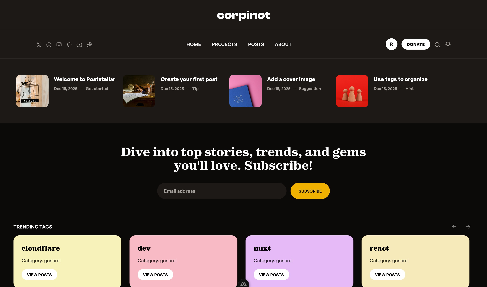
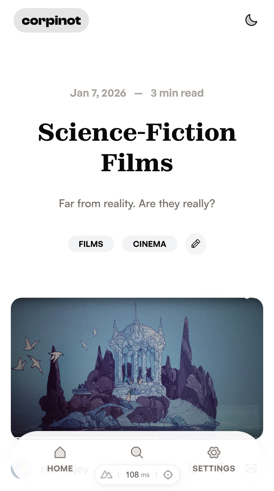

# Corpinot 🚀

> A modern, full-featured blogging platform powered by Nuxt 4 — built for curious minds and creative builders.



## ✨ What is Corpinot?

Corpinot is a next-generation blogging platform designed for simplicity, speed, and delightful content creation. Built with cutting-edge web technologies, it offers a seamless experience for writers, readers, and content managers.

### 🎯 Key Features

- **🎨 Rich Content Editor** — TipTap-powered editor with support for images, videos, audio, code blocks, tables, and more
- **⚡ Lightning Fast** — Built on Nuxt 4 with SSR, SSG, and edge deployment support via NuxtHub/Cloudflare Workers
- **🤖 AI-Powered Writing** — Integrated AI writer using Cloudflare Workers AI for content generation and suggestions
- **📱 Mobile-First Design** — Responsive UI with dedicated mobile experiences using UnoCSS and Una UI
- **🏷️ Smart Tagging System** — Organize content with categories, featured posts, and trending tags
- **👥 Multi-Author Support** — User management with profiles, avatars, and author pages
- **🖼️ Advanced Image Handling** — Custom blob storage provider with automatic optimization via @nuxt/image
- **🔍 Full-Text Search** — Fast search across posts, tags, and authors
- **📊 Post Metrics** — Track views, likes, and comments
- **📧 Newsletter Integration** — Built-in newsletter subscription system
- **🌙 Dark Mode** — Beautiful light and dark themes
- **📤 Import/Export** — Export posts with assets for backup or migration

### 🛠️ Tech Stack

- **Framework:** [Nuxt 4](https://nuxt.com/) (TypeScript)
- **UI:** [Una UI](https://una-ui.com/) + [UnoCSS](https://unocss.dev/)
- **Editor:** [TipTap](https://tiptap.dev/) (extensible rich-text editor)
- **Database:** SQLite via [Drizzle ORM](https://orm.drizzle.team/)
- **Storage:** Cloudflare R2 via [@nuxthub/core](https://hub.nuxt.com/)
- **Images:** [@nuxt/image](https://image.nuxt.com/) with custom blob provider
- **State:** [Pinia](https://pinia.vuejs.org/)
- **AI:** [Cloudflare Workers AI](https://ai.cloudflare.com/) + [Vercel AI SDK](https://sdk.vercel.ai/)
- **Deployment:** [NuxtHub](https://hub.nuxt.com/) / Cloudflare Workers

---

## 🚀 Quick Start

### Prerequisites

- Node.js 18+ or Bun
- A Cloudflare account (for deployment)

### Installation

Install dependencies:

```bash
bun install
# or npm install / pnpm install / yarn install
```

### Development Server

Start the development server on `http://localhost:3000`:

```bash
bun run dev
# or npm run dev / pnpm dev / yarn dev
```

### Production Build

Build the application for production:

```bash
bun run build
```

Preview the production build locally:

```bash
bun run preview
```

Check out the [NuxtHub deployment documentation](https://hub.nuxt.com/docs/getting-started/deploy) for deploying to Cloudflare Workers.

---

## ⚙️ Configuration

### Environment Variables

Create a `.env` file in the root directory:

```bash
# AI Writer (optional)
NUXT_AI_CLOUDFLARE_ACCOUNT_ID=your_account_id
NUXT_AI_CLOUDFLARE_KEY=your_api_key
NUXT_PUBLIC_FEATURE_AI_WRITER=true

# Site URL (for image generation)
NUXT_PUBLIC_SITE_URL=http://localhost:3000
```

### Database Setup

The database is automatically initialized on first run. Migrations are located in `server/db/migrations/`.

---

## 📝 Content Management

### Creating Posts

1. Sign in to the platform
2. Click "New Post" from the header or profile menu
3. Use the rich TipTap editor to create your content
4. Add tags, cover image, and metadata
5. Publish when ready

### Editor Features

- **Rich Text Formatting** — Bold, italic, headings, lists, quotes, and more
- **Media Support** — Images, videos, and audio files
- **Code Blocks** — Syntax-highlighted code with language selection
- **Tables** — Create and edit tables inline
- **AI Assistant** — Generate content suggestions with AI
- **Drag & Drop** — Reorder content blocks easily
- **Auto-save** — Never lose your work

### Post Status

- **Draft** — Work in progress, not visible to public
- **Published** — Live and visible to all readers
- **Archived** — Hidden from public view but preserved

---

## 🎨 Customization

### Styling

The project uses UnoCSS with custom shortcuts defined in `unocss.config.ts`. Styles are organized in:

- `app/styles/main.css` — Global styles
- `app/styles/editor.css` — Editor-specific styles
- `app/styles/code-theme.css` — Code highlighting themes

### Components

All components are auto-imported from `app/components/`. Key components include:

- **Editor components** — `app/components/editor/` (TipTap extensions and node views)
- **UI components** — Using Una UI with `N` prefix
- **Layout components** — Header, footer, navigation

---

## 🔧 Development Notes

### Editor Linting & @apply Warnings

If your editor shows warnings like `Unknown at rule @apply (css(unknownAtRules))`, this is the CSS language server complaining about UnoCSS-specific at-rules.

This repo includes:
- `.stylelintrc.cjs` — Whitelists utility at-rules
- `.vscode/settings.json` — Silences unknown at-rule warnings

### Terminal Management

Never run commands (e.g., tests, builds) in a terminal that already has `bun run dev` running. These will fail or hang. Always open a separate terminal for concurrent commands.

### Database Access (Local Development)

You can query the SQLite database directly for debugging:

```bash
sqlite3 .data/hub/d1/miniflare-D1DatabaseObject/7b8799eb95f0bb5448e259812996a461ce40142dacbdea254ea597e307767f45.sqlite
```

**Important:** All schema changes must be done via SQL migrations in `server/db/migrations/`. Never modify the database directly in production.

---

## 🚢 Deployment

### NuxtHub / Cloudflare Workers

1. Create a [NuxtHub](https://hub.nuxt.com/) account
2. Link your repository
3. Configure environment variables
4. Deploy with:

```bash
npx nuxthub deploy
```

### Traditional Node Server

Build and serve with Node:

```bash
bun run build
node .output/server/index.mjs
```

---

## 📸 Screenshots

| Desktop Home | Mobile Post |
|--------------|-------------|
|  |  |

---

## 🤝 Contributing

Contributions are welcome! Please feel free to submit a Pull Request.

1. Fork the repository
2. Create your feature branch (`git checkout -b feature/amazing-feature`)
3. Commit your changes (`git commit -m 'Add some amazing feature'`)
4. Push to the branch (`git push origin feature/amazing-feature`)
5. Open a Pull Request

---

## 📄 License

This project is open source and available under the MIT License.

---

## 🙏 Acknowledgments

- [Nuxt](https://nuxt.com/) — The Intuitive Vue Framework
- [Una UI](https://una-ui.com/) — Beautifully designed components
- [TipTap](https://tiptap.dev/) — The headless editor framework
- [NuxtHub](https://hub.nuxt.com/) — Deploy Nuxt on Cloudflare
- [UnoCSS](https://unocss.dev/) — Instant on-demand atomic CSS

---

<div align="center">

**[Documentation](https://github.com/rootasjey/corpinot/wiki)** • **[Report Bug](https://github.com/rootasjey/corpinot/issues)** • **[Request Feature](https://github.com/rootasjey/corpinot/issues)**

Made with ❤️ by [rootasjey](https://github.com/rootasjey)

</div>
